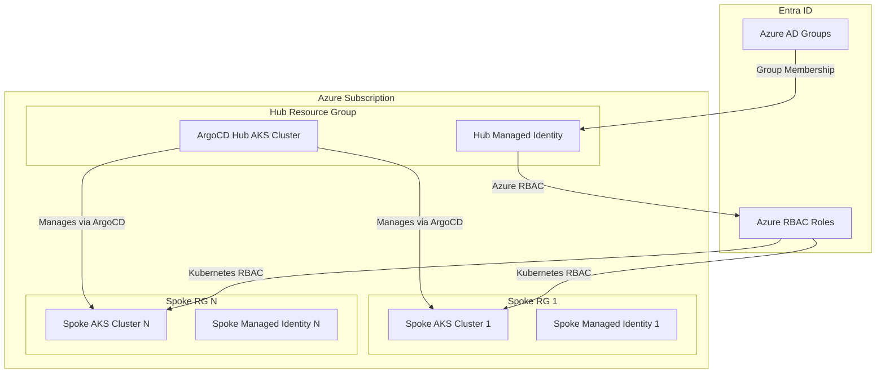

# ArgoCD Hub-Spoke AKS Cluster Management Pattern

This repository provides a complete solution for managing multiple AKS spoke clusters from a central ArgoCD hub cluster using Azure RBAC for Kubernetes authorization and Terraform for infrastructure management.

## Architecture Overview



## Key Components

### 1. Hub Cluster (ArgoCD Controller)
- **Purpose**: Central management and deployment orchestration
- **Features**: 
  - ArgoCD installed with cluster admin privileges
  - Azure RBAC for Kubernetes authorization enabled
  - Managed Identity with cross-resource group permissions
  - Network connectivity to all spoke clusters

### 2. Spoke Clusters (Workload Clusters)
- **Purpose**: Run application workloads
- **Features**:
  - Azure RBAC for Kubernetes authorization enabled
  - Role bindings for Hub cluster managed identity
  - Automated kubeconfig sharing mechanism
  - Minimal administrative overhead

### 3. Identity and Access Management
- **Hub Managed Identity**: Central identity for cluster management
- **Azure RBAC**: Resource-level access control
- **Kubernetes RBAC**: Cluster-level access control
- **Entra ID Integration**: Seamless authentication flow

## Directory Structure

```
argo/
├── README.md                          # This file
├── terraform/
│   ├── modules/
│   │   ├── aks-hub/                   # Hub cluster module
│   │   ├── aks-spoke/                 # Spoke cluster module
│   │   └── rbac/                      # RBAC configuration module
│   ├── environments/
│   │   ├── hub/                       # Hub cluster deployment
│   │   └── spokes/                    # Spoke clusters deployment
│   └── shared/                        # Shared resources and variables
├── argocd/
│   ├── cluster-secrets/               # Cluster connection secrets
│   ├── applications/                  # ArgoCD applications
│   └── projects/                      # ArgoCD projects
├── kubernetes/
│   ├── rbac/                          # Kubernetes RBAC manifests
│   └── bootstrap/                     # Initial cluster setup
└── docs/
    ├── setup-guide.md                 # Step-by-step implementation
    ├── troubleshooting.md             # Common issues and solutions
    └── security.md                    # Security considerations
```

## Quick Start

### Prerequisites
- Azure CLI installed and logged in
- Terraform >= 1.5
- kubectl installed
- Appropriate Azure permissions (Contributor on subscriptions/RGs)

### 1. Deploy Hub Cluster
```bash
cd terraform/environments/hub
terraform init
terraform plan -var-file="hub.tfvars"
terraform apply
```

### 2. Deploy Spoke Cluster(s)
```bash
cd terraform/environments/spokes
terraform init
terraform plan -var-file="spoke-prod.tfvars"
terraform apply
```

### 3. Configure ArgoCD
```bash
# Install ArgoCD on hub cluster
kubectl apply -n argocd -f argocd/bootstrap/

# Add spoke clusters to ArgoCD
kubectl apply -f argocd/cluster-secrets/
```

## Key Features

### 🔐 **Automated Authentication**
- Hub cluster managed identity automatically gets access to spoke clusters
- No manual kubeconfig management required
- Seamless token refresh and rotation

### 🏗️ **Infrastructure as Code**
- Complete Terraform modules for reproducible deployments
- Parameterized configurations for different environments
- Automated RBAC setup during cluster creation

### 🎯 **GitOps Integration**
- ArgoCD applications automatically discover new spoke clusters
- Declarative cluster management through Git
- Automated application deployment across clusters

### 🛡️ **Security Best Practices**
- Principle of least privilege access
- Azure RBAC integration with Kubernetes RBAC
- Audit logging and compliance ready

### ⚡ **Operational Efficiency**
- Single pane of glass for multi-cluster management
- Automated cluster onboarding process
- Standardized deployment patterns

## Next Steps

1. Review the [Setup Guide](docs/setup-guide.md) for detailed implementation steps
2. Check [Security Considerations](docs/security.md) for production deployment
3. See [Troubleshooting Guide](docs/troubleshooting.md) for common issues

## Support and Contributing

For questions and contributions, please refer to the respective documentation sections and follow the established patterns for consistency.
